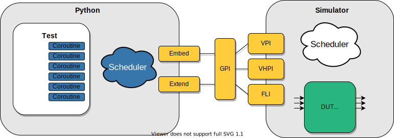

*********************
GPI Library Reference
*********************

Cocotb contains a library called ``GPI`` (in directory :file:`src/cocotb/share/lib/gpi/`) written in C++
that is an abstraction layer for the VPI, VHPI, and FLI simulator interfaces.

The interaction between Python and GPI is via a Python extension module called ``simulator``
(in directory :file:`src/cocotb/share/lib/simulator/`) which provides routines for
traversing the hierarchy, getting/setting an object's value, registering callbacks etc.

.. doxygenfile:: gpi.h
   :sections: brief detaileddescription define typedef enum

.. doxygengroup:: SimIntf
.. doxygengroup:: ObjQuery
.. doxygengroup:: ObjProps
.. doxygengroup:: SigProps
.. doxygengroup:: HandleIteration
.. doxygengroup:: SimCallbacks
