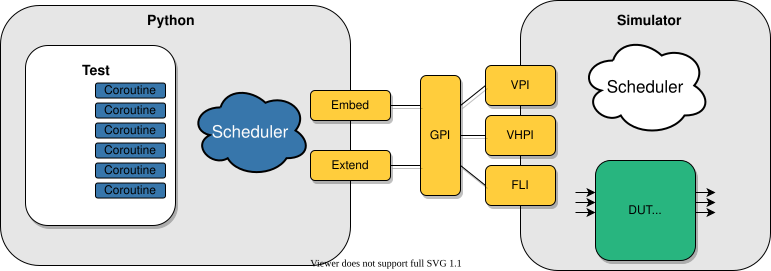

*********************
GPI Library Reference
*********************

cocotb contains a native library called :term:`GPI` (Generic Procedural Interface)
that is an abstraction layer for the VPI, VHPI, and FLI simulator interfaces.

The interaction between cocotb's Python and GPI is via a Python extension module called the :ref:`PyGPI <pygpi>`.

Environment Variables
=====================

.. envvar:: COCOTB_BOOTSTRAP

    An ordered list of native libraries to load, and optionally functions in those libraries to call,
    when cocotb is loaded by the simulator.

    This list is separated using the platform's path-list separator:
    ``:`` on Linux and macOS, and ``;`` on Windows.
    Each element of the list contains a path to a library to load.
    These paths can be full paths (e.g. ``/usr/local/lib/libstuff.so``), in which case the exact library will be loaded,
    or the basename (e.g. ``libstuff.so``), in which case your operating system's dynamic library lookup will be used.

    Optionally, after the path in each element, a function in that library to call can be specified by name
    by suffixing the path with a comma followed by the function name.
    Entry functions take no arguments and return an integer.
    Returning ``0`` continues loading, a positive value stops successfully, and a negative value reports failure.

    For example:

    * ``COCOTB_BOOTSTRAP=/usr/local/lib/libstuff.so:libotherstuff.so,entry_func``

    .. attention::
        This means that paths which contain ``,`` or the platform's path-list separator cannot be used in this variable.
        Instead of using a full path, use the basename, and use environment variables like ``PATH`` or ``LD_LIBRARY_PATH``
        to modify your operating system's library search path.

    When using the :ref:`building` or :ref:`api-runner` this defaults to initialize GPI,
    load ``libpython``, and then call the PyGPI entry point.
    You can get the GPI and PyGPI entries by calling ``cocotb-config --gpi-entry-point`` and
    ``cocotb-config --pygpi-entry-point`` from the shell, respectively.

.. envvar:: GPI_IMPL

    A comma-separated list of extra libraries that are dynamically loaded at runtime.
    A function from each of these libraries will be called as an entry point prior to elaboration,
    allowing these libraries to register system functions and callbacks.
    Note that :term:`HDL` objects cannot be accessed at this time.
    An entry point function must be named following a ``:`` separator,
    which follows an existing simulator convention.

    For example:

    * ``GPI_IMPL=libnameA.so:entryA,libnameB.so:entryB`` will first load ``libnameA.so`` with entry point ``entryA`` , then load ``libnameB.so`` with entry point ``entryB``.

    Use ``cocotb-config --gpi-impl SIMULATOR INTERFACE [INTERFACE ...]``
    to produce this list for cocotb's simulator implementation libraries.

    .. versionchanged:: 1.4
        Support for the custom entry point via ``:`` was added.
        Previously ``:`` was used as a separator between libraries instead of ``,``.

    .. versionchanged:: 1.5
        Library name must be fully specified.
        This allows using relative or absolute paths in library names,
        and loading from libraries that `aren't` prefixed with "lib".
        Paths `should not` contain commas.

C API
=====

.. doxygenfile:: gpi.h
   :sections: brief detaileddescription

User Handles
------------
These types and functions are about handles the GPI provides to users
for interacting with GPI-managed objects.

.. doxygentypedef:: gpi_sim_hdl
.. doxygentypedef:: gpi_iterator_hdl
.. doxygentypedef:: gpi_cb_hdl

GPI Functionality
-----------------

Simulator Control and Interrogation
+++++++++++++++++++++++++++++++++++
.. doxygengroup:: SimIntf

Simulation Object Query
+++++++++++++++++++++++
.. doxygengroup:: ObjQuery

General Object Properties
+++++++++++++++++++++++++
.. doxygengroup:: ObjProps

Signal Object Properties
++++++++++++++++++++++++
.. doxygengroup:: SigProps

Simulation Object Iteration
+++++++++++++++++++++++++++
.. doxygengroup:: HandleIteration

Simulation Callbacks
++++++++++++++++++++
.. doxygengroup:: SimCallbacks

Logging Dependency Injection
++++++++++++++++++++++++++++
.. doxygengroup:: Logging
