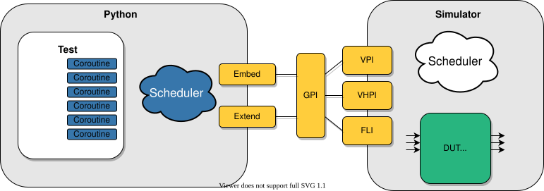

*********************
GPI Library Reference
*********************

cocotb contains a native library called :term:`GPI` (Generic Procedural Interface)
that is an abstraction layer for the VPI, VHPI, and FLI simulator interfaces.

The interaction between cocotb's Python and GPI is via a Python extension module called the :ref:`PyGPI <pygpi>`.

Environment Variables
=====================

.. envvar:: COCOTB_BOOTSTRAP

    An ordered list of native libraries (``.so``, ``.dll``, or ``.dylib``) to load,
    and optionally functions in those libraries to call,
    after the simulator has started, but before simulation begins.

    This list is separated using the platform's path-list separator:
    ``:`` on Linux and macOS, and ``;`` on Windows.
    Each element of the list contains a path to a library to load.
    Leading or trailing whitespace on each element is ignored.
    Empty elements are ignored.

    Each element can be a full path to a native library (e.g. ``/usr/local/lib/libstuff.so``),
    in which case the exact library will be loaded,
    or a basename (e.g. ``libstuff.so``),
    in which case your operating system's dynamic library lookup will be used.

    Optionally, for each element, an entry function to call after loading the library can be given
    by suffixing the path with a comma (``,``) followed by the function name.
    Entry functions take no arguments and return an ``int``.
    Returning a non-zero value indicates failure and the simulation is ended prematurely with the C :func:`!exit` function.

    For example:

    * ``COCOTB_BOOTSTRAP=/usr/local/lib/libstuff.so:libotherstuff.so,entry_func``

    .. attention::
        This means that paths which contain ``,`` or the platform's path-list separator cannot be used in this variable.
        Instead of using a full path, use the basename, and use environment variables like ``PATH`` or ``LD_LIBRARY_PATH``
        to modify your operating system's library search path.

    When using the :ref:`building` or :ref:`api-runner` the behavior defaults to the following:

    1. Load the GPI, thus in turn loads the simulator's :term:`GPI Implementation Library`.
    2. Load ``libpython.so``.
    3. Load the PyGPI, which eventually loads the :envvar:`PYGPI_USERS` and enters Python.

    You can get the GPI entry points used by the cocotb flows by calling ``cocotb-config --gpi-entry-point``.

    .. versionadded:: 2.2

.. envvar:: GPI_IMPL

    A comma-separated list of :term:`GPI Implementation Libraries <GPI Implementation Library>` that are dynamically loaded during GPI initialization.
    A function from each of these libraries will be called as an entry point prior to elaboration,
    allowing these libraries to register system functions and callbacks.
    Note that :term:`HDL` objects cannot be accessed at this time.
    An entry point function must be named following a ``:`` separator,
    which follows an existing simulator convention.

    For example:

    * ``GPI_IMPL=libnameA.so:entryA,libnameB.so:entryB`` will first load ``libnameA.so`` with entry point ``entryA`` , then load ``libnameB.so`` with entry point ``entryB``.

    Use ``cocotb-config --gpi-impl SIMULATOR INTERFACE [INTERFACE ...]`` to produce this list for cocotb's simulator implementation libraries.
    ``SIMULATOR`` is the simulator's name (e.g. ``icarus`` or ``nvc``).
    ``INTERFACE`` is ``vpi`` or ``vpi`` (or ``fli`` when ``SIMULATOR`` is ``questa``).

    .. versionadded:: 2.2

C API
=====

.. doxygenfile:: gpi.h
   :sections: brief detaileddescription

User Handles
------------
These types and functions are about handles the GPI provides to users
for interacting with GPI-managed objects.

.. doxygentypedef:: gpi_sim_hdl
.. doxygentypedef:: gpi_iterator_hdl
.. doxygentypedef:: gpi_cb_hdl

GPI Functionality
-----------------

Simulator Control and Interrogation
+++++++++++++++++++++++++++++++++++
.. doxygengroup:: SimIntf

Simulation Object Query
+++++++++++++++++++++++
.. doxygengroup:: ObjQuery

General Object Properties
+++++++++++++++++++++++++
.. doxygengroup:: ObjProps

Signal Object Properties
++++++++++++++++++++++++
.. doxygengroup:: SigProps

Simulation Object Iteration
+++++++++++++++++++++++++++
.. doxygengroup:: HandleIteration

Simulation Callbacks
++++++++++++++++++++
.. doxygengroup:: SimCallbacks

Logging Dependency Injection
++++++++++++++++++++++++++++
.. doxygengroup:: Logging
