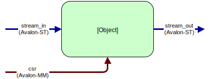
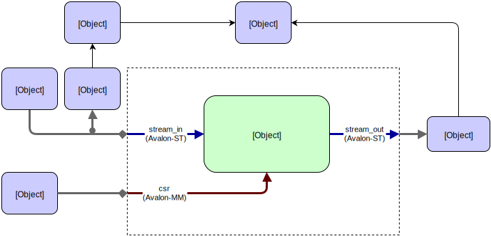

************************
Tutorial: Endian Swapper
************************

In this tutorial we'll use some of the built-in features of cocotb to quickly create a complex testbench.

.. note:: All the code and sample output from this example are available on `EDA Playground <https://www.edaplayground.com/s/example/199>`_

For the impatient this tutorial is provided as an example with cocotb.
You can run this example from a fresh checkout::

    cd examples/endian_swapper/tests
    make

Design
======

We have a relatively simplistic :term:`RTL` block called the ``endian_swapper``.
The :term:`DUT` has three interfaces, all conforming to the Avalon standard:

The :term:`DUT` will swap the endianness of packets on the Avalon-ST bus if a configuration bit is set.
For every packet arriving on the ``stream_in`` interface the entire packet will be endian swapped
if the configuration bit is set, otherwise the entire packet will pass through unmodified.

Testbench
=========

To begin with we create a class to encapsulate all the common code for the testbench.
It is possible to write directed tests without using a testbench class
however to encourage code re-use it is good practice to create a distinct class.

.. code-block:: python3

    class EndianSwapperTB(object):

        def __init__(self, dut):
            self.dut = dut
            self.stream_in  = AvalonSTDriver(dut, "stream_in", dut.clk)
            self.stream_out = AvalonSTMonitor(dut, "stream_out", dut.clk)
            self.csr = AvalonMaster(dut, "csr", dut.clk)

            self.expected_output = []
            self.scoreboard = Scoreboard(dut)
            self.scoreboard.add_interface(self.stream_out, self.expected_output)

            # Reconstruct the input transactions from the pins and send them to our 'model'
            self.stream_in_recovered = AvalonSTMonitor(dut, "stream_in", dut.clk, callback=self.model)

With the above code we have created a testbench with the following structure:

If we inspect this line-by-line:

.. code-block:: python3

    self.stream_in  = AvalonSTDriver(dut, "stream_in", dut.clk)

Here we are creating an :class:`AvalonSTDriver <cocotb_bus.drivers.avalon.AvalonSTPkts>` instance.
The constructor requires 3 arguments - a handle to the entity containing the interface (``dut``),
the name of the interface (``stream_in``) and the associated clock with which to drive the interface (``dut.clk``).
The driver will auto-discover the signals for the interface,
assuming that they follow the naming convention ``<interface_name>_<signal>``.

In this case we have the following signals defined for the ``stream_in`` interface:

=========================== ================= ==============================================================================================
Name                        Type              Description (from Avalon Specification)
=========================== ================= ==============================================================================================
``stream_in_data``          ``data``          The data signal from the source to the sink
``stream_in_empty``         ``empty``         Indicates the number of symbols that are empty during cycles that contain the end of a packet
``stream_in_valid``         ``valid``         Asserted by the source to qualify all other source to sink signals
``stream_in_startofpacket`` ``startofpacket`` Asserted by the source to mark the beginning of a packet
``stream_in_endofpacket``   ``endofpacket``   Asserted by the source to mark the end of a packet
``stream_in_ready``         ``ready``         Asserted high to indicate that the sink can accept data
=========================== ================= ==============================================================================================

By following the signal naming convention the driver can find the signals associated with this interface automatically.

.. code-block:: python3

            self.stream_out = AvalonSTMonitor(dut, "stream_out", dut.clk)
            self.csr = AvalonMaster(dut, "csr", dut.clk)

We do the same to create the :class:`monitor <cocotb_bus.monitors.avalon.AvalonSTPkts>` on ``stream_out`` and the CSR interface.

.. code-block:: python3

            self.expected_output = []
            self.scoreboard = Scoreboard(dut)
            self.scoreboard.add_interface(self.stream_out, self.expected_output)

The above lines create a :class:`cocotb_bus.scoreboard.Scoreboard` instance and attach it to the ``stream_out`` monitor instance.
The scoreboard is used to check that the :term:`DUT` behavior is correct.
The call to :meth:`.add_interface()` takes a Monitor instance as the first argument and
the second argument is a mechanism for describing the expected output for that interface.
This could be a callable function but in this example a simple list of expected transactions is sufficient.

.. code-block:: python3

            # Reconstruct the input transactions from the pins and send them to our 'model'
            self.stream_in_recovered = AvalonSTMonitor(dut, "stream_in", dut.clk, callback=self.model)

Finally we create another Monitor instance, this time connected to the ``stream_in`` interface.
This is to reconstruct the transactions being driven into the :term:`DUT`.
It's good practice to use a monitor to reconstruct the transactions from the pin interactions
rather than snooping them from a higher abstraction layer as we can gain confidence that our drivers and monitors are functioning correctly.

We also pass the keyword argument ``callback`` to the monitor constructor which will result
in the supplied function being called for each transaction seen on the bus with the transaction as the first argument.
Our model function is quite straightforward in this case - we simply append the transaction to the expected output list and increment a counter:

.. code-block:: python3

    def model(self, transaction):
        """Model the DUT based on the input transaction"""
        self.expected_output.append(transaction)
        self.pkts_sent += 1

Test Function
-------------

There are various 'knobs' we can tweak on this testbench to vary the behavior:

* Packet size
* Backpressure on the ``stream_out`` interface
* Idle cycles on the ``stream_in`` interface
* Configuration switching of the endian swap register during the test.

We want to run different variations of tests but they will all have a very similar structure so we create a common ``run_test`` function.
To generate backpressure on the ``stream_out`` interface we use the :class:`~cocotb_bus.drivers.BitDriver` class from :mod:`cocotb_bus.drivers`.

.. code-block:: python3

    @cocotb.coroutine
    def run_test(dut, data_in=None, config_coroutine=None, idle_inserter=None, backpressure_inserter=None):

        cocotb.fork(Clock(dut.clk, 5000).start())
        tb = EndianSwapperTB(dut)

        yield tb.reset()
        dut.stream_out_ready <= 1

        # Start off any optional coroutines
        if config_coroutine is not None:
            cocotb.fork(config_coroutine(tb.csr))
        if idle_inserter is not None:
            tb.stream_in.set_valid_generator(idle_inserter())
        if backpressure_inserter is not None:
            tb.backpressure.start(backpressure_inserter())

        # Send in the packets
        for transaction in data_in():
            yield tb.stream_in.send(transaction)

        # Wait at least 2 cycles where output ready is low before ending the test
        for i in range(2):
            yield RisingEdge(dut.clk)
            while not dut.stream_out_ready.value:
                yield RisingEdge(dut.clk)

        pkt_count = yield tb.csr.read(1)

        if pkt_count.integer != tb.pkts_sent:
            raise TestFailure("DUT recorded %d packets but tb counted %d" % (
                            pkt_count.integer, tb.pkts_sent))
        else:
            dut._log.info("DUT correctly counted %d packets" % pkt_count.integer)

        raise tb.scoreboard.result

We can see that this test function creates an instance of the testbench,
resets the :term:`DUT` by running the coroutine ``tb.reset()`` and then starts off any optional coroutines passed in using the keyword arguments.
We then send in all the packets from ``data_in``, ensure that all the packets have been received by waiting 2 cycles at the end.
We read the packet count and compare this with the number of packets.
Finally we use the :any:`tb.scoreboard.result <cocotb_bus.scoreboard.Scoreboard.result>` to determine the status of the test.
If any transactions didn't match the expected output then this member would be an instance of the :exc:`~cocotb.results.TestFailure` result.

Test permutations
-----------------

Having defined a test function we can now auto-generate different permutations of tests using the :class:`~cocotb.regression.TestFactory` class:

.. code-block:: python3

    factory = TestFactory(run_test)
    factory.add_option("data_in",                 [random_packet_sizes])
    factory.add_option("config_coroutine",        [None, randomly_switch_config])
    factory.add_option("idle_inserter",           [None, wave, intermittent_single_cycles, random_50_percent])
    factory.add_option("backpressure_inserter",   [None, wave, intermittent_single_cycles, random_50_percent])
    factory.generate_tests()

This will generate 32 tests (named ``run_test_001`` to ``run_test_032``) with all possible permutations of the options provided for each argument.
Note that we utilize some of the built-in generators to toggle backpressure and insert idle cycles.
