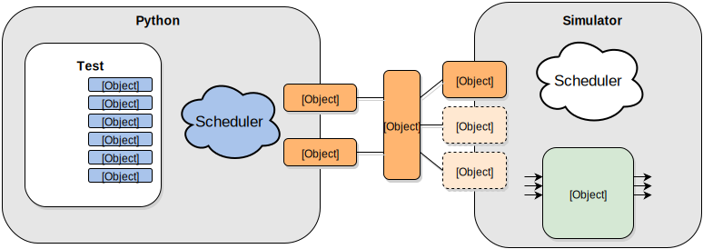

##################################
Welcome to cocotb's documentation!
##################################

..
   This documentation tries to follow https://www.divio.com/blog/documentation/ (Daniele Procida)
   Other media about the same topic:
   - https://ep2018.europython.eu/media/conference/slides/get-your-documentation-right.pdf
   - https://www.youtube.com/watch?v=t4vKPhjcMZg
   - A good example: http://docs.django-cms.org/en/latest/contributing/documentation.html#contributing-documentation

   See also https://github.com/cocotb/cocotb/wiki/Howto:-Writing-Documentation

***************
What is cocotb?
***************

**cocotb** is a *COroutine* based *COsimulation* *TestBench* environment for verifying VHDL and SystemVerilog :term:`RTL` using `Python <https://www.python.org>`_.

cocotb is completely free, open source (under the `BSD License <https://en.wikipedia.org/wiki/BSD_licenses#3-clause_license_(%22BSD_License_2.0%22,_%22Revised_BSD_License%22,_%22New_BSD_License%22,_or_%22Modified_BSD_License%22)>`_) and hosted on `GitHub <https://github.com/cocotb/cocotb>`_.

cocotb requires a simulator to simulate the :term:`HDL` design
and has been used with a variety of simulators on Linux, Windows and macOS.
Please check the :ref:`simulator-support` page for specifics.

A (possibly older) version of cocotb can be used live in a web browser on `EDA Playground <https://www.edaplayground.com>`_.

************************
How is cocotb different?
************************

cocotb encourages the same philosophy of design re-use and randomized testing as
`UVM <https://en.wikipedia.org/wiki/Universal_Verification_Methodology>`_,
however is implemented in Python.

With cocotb, VHDL or SystemVerilog are normally only used for the design itself, not the testbench.

cocotb has built-in support for integrating with continuous integration systems,
such as Jenkins, GitLab, etc. through standardized, machine-readable test reporting formats.

cocotb was specifically designed to lower the overhead of creating a test.

cocotb automatically discovers tests so that no additional step is required to add a test to a regression.

All verification is done using Python which has various advantages over using SystemVerilog or VHDL for verification:

* Writing Python is **fast** - it's a very productive language.
* It's **easy** to interface to other languages from Python.
* Python has a huge library of existing code to **re-use**.
* Python is **interpreted** - tests can be edited and re-run without having to recompile the design or exit the simulator GUI.
* Python is **popular** - far more engineers know Python than SystemVerilog or VHDL.

*********************
How does cocotb work?
*********************

A typical cocotb testbench requires no additional :term:`RTL` code.
The Design Under Test (:term:`DUT`) is instantiated as the toplevel in the simulator without any wrapper code.
cocotb drives stimulus onto the inputs to the :term:`DUT` (or further down the hierarchy) and monitors the outputs directly from Python.
Note that cocotb can not instantiate :term:`HDL` blocks - your DUT must be complete.

A test is simply a Python function.
At any given time either the simulator is advancing time or the Python code is executing.
The :keyword:`await` keyword is used to indicate when to pass control of execution back to the simulator.
A test can spawn multiple coroutines, allowing for independent flows of execution.

.. toctree::
   :maxdepth: 1
   :hidden:

   quickstart
   install

..
   Tutorials - lessons that take the reader by the hand through a series of steps to complete a project
   (Example: kid cooking; learning-oriented)

   - learning by doing
   - getting started
   - inspiring confidence
   - repeatability
   - immediate sense of achievement
   - concreteness, not abstraction
   - minimum necessary explanation
   - no distractions

.. toctree::
   :maxdepth: 1
   :caption: Tutorials
   :name: tutorials
   :hidden:

   endian_swapper
   hal_cosimulation
   examples

..
   How-To Guides - guides that take the reader through the steps required to solve a common problem
   (Example: recipe; problem-oriented)

   - a series of steps
   - a focus on the goal
   - addressing a specific question
   - no unnecessary explanation
   - a little flexibility
   - practical usability
   - good naming

.. toctree::
   :maxdepth: 1
   :caption: How-to Guides
   :name: howto_guides
   :hidden:

   writing_testbenches
   coroutines
   triggers
   testbench_tools
   custom_flows
   rotating_logger

.. todo::
   - Add WaveDrom, IPython sections
   - How to deal with existing Verification IP?
   - Point to https://github.com/cocotb/cocotb/wiki/Code-Examples

..
   Explanation (Background, Discussions) - discussions that clarify and illuminate a particular topic
   (Example: history of cooking; understanding-oriented)

   - giving context
   - explaining why
   - multiple examples, alternative approaches
   - making connections
   - no instruction or technical description

.. toctree::
   :maxdepth: 1
   :caption: Key topics
   :name: key_topics
   :hidden:

   install_devel
   troubleshooting

.. todo::
   - Move section "How does cocotb work?" from Introduction to here
   - Add some info from :doc:`coroutines`
   - Add GPI section
   - Explain ReadOnly/ReadWrite/... phases
   - Add pitfall from https://github.com/cocotb/cocotb/issues/526#issuecomment-300371629 to troubleshooting

..
   Reference - technical descriptions of the machinery and its operation
   (Example: Wikipedia pages of ingredients; information-oriented)

   - structure
   - consistency
   - description
   - accuracy

.. toctree::
   :maxdepth: 1
   :caption: Reference
   :name: reference
   :hidden:

   building
   Python Code Library Reference <library_reference>
   GPI Library Reference <library_reference_c>
   simulator_support
   extensions
   refcard

.. toctree::
   :maxdepth: 1
   :caption: Development & Community
   :name: development_community
   :hidden:

   roadmap
   contributors
   release_notes
   further_resources

.. todo::
   - Add "Join us online" and "Contributing"
   - In Contributing, add explanation on how to provide a PR, how to test existing PRs, etc.
   - merge `further_resources` into Contributing

.. toctree::
   :maxdepth: 1
   :caption: Index
   :name: index
   :hidden:

   Classes, Methods, Variables etc. <genindex>
   Python Modules <py-modindex>
   glossary
