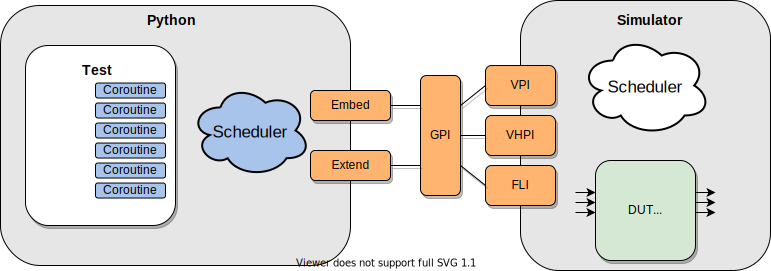

##################
Overview of cocotb
##################

Overview
========

A typical cocotb testbench requires no additional RTL code. The Design Under Test (DUT) is instantiated as the toplevel in the simulator without any wrapper code. Cocotb drives stimulus onto the inputs to the DUT (or further down the hierarchy) and monitors the outputs directly from Python.

Cocotb comprises 3 layers:

GPI (Generic Procedural Interface)
----------------------------------

This layer abstracts the simulator language interface to provide a common set of functionality. Supports VHDL via VHPI and Verilog/SystemVerilog via VPI. Modelsim FLI may be supported in the future.

simulatormodule
---------------

A CPython extension which utilises GPI to expose the simulator to Python.

cocotb Python package
---------------------

Python infrastructure including coroutine scheduler, base classes etc. The cocotb package provides a mechanism to traverse the hierarchy, query signal values, force signals to particular values and control simulator execution.

