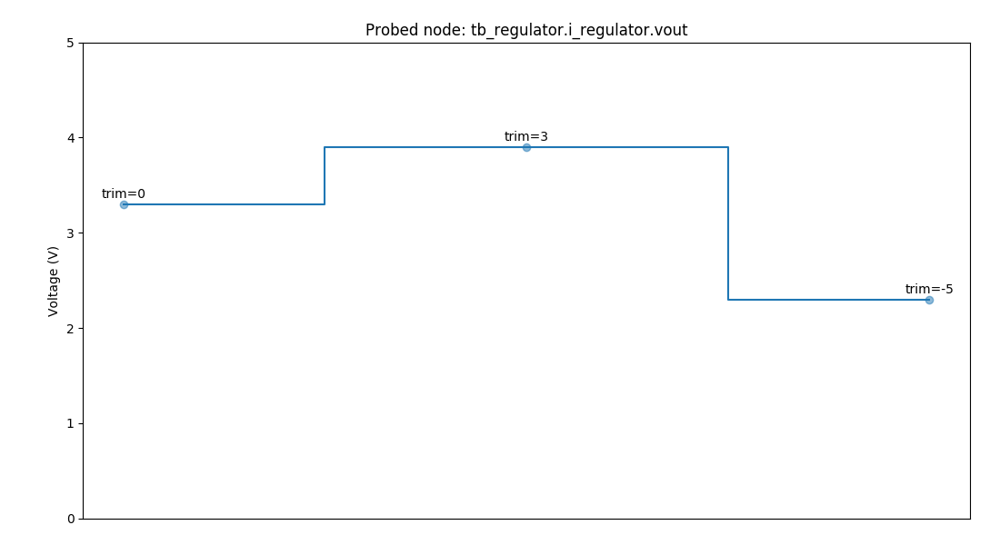

##################################
The cocotb ``regulator`` Testbench
##################################

.. versionadded:: 1.5

This is the testbench :mod:`test_regulator` for the design ``regulator`` showing
how cocotb can be used in an analog-mixed signal (AMS) simulation.

.. note:: The analog probe module used in this testcase is currently only implemented for the
          Cadence Incisive and Xcelium simulators (with the AMS option available).
          Help is appreciated to provide equivalent modules for other simulators.

******************
Overview Schematic
******************

**********
The Design
**********

The design ``i_regulator`` consists of a trimmable regulator model written in Verilog-AMS
(instance name ``i_regulator_block``), and load resistor (instance name ``i_resistor``).

.. literalinclude:: ../../examples/mixed_signal/hdl/regulator.sv
   :caption: regulator.sv
   :language: systemverilog
   :start-at: module regulator

The regulator block itself is modeled as shown below:

.. literalinclude:: ../../examples/mixed_signal/hdl/regulator_block.vams
   :caption: regulator_block.vams
   :language: systemverilog
   :start-at: `include "disciplines.vams"

*************
The Testbench
*************

The testbench consists of both an :term:`HDL` part and a Python/cocotb part.
While having HDL as part of the testbench is not common with cocotb, it is perfectly possible.

The HDL part of the Testbench
=============================

The testbench HDL part is written in SystemVerilog and instantiates the design described above
as ``i_regulator``.
It also contains a probe module for analog values as instance ``i_analog_probe`` —
imagine this being a multimeter that you quickly connect to different nodes in the design,
measuring either voltage or current.

.. literalinclude:: ../../examples/mixed_signal/hdl/tb_regulator.sv
   :caption: tb_regulator.sv
   :language: systemverilog
   :start-at: import nettypes_pkg

The probe module can capture voltage and current of a node specified by ``node_to_probe``
(a string in this module containing a hierarchical path).
The capturing occurs whenever there is an edge on the logic signals
``probe_voltage_toggle`` or ``probe_current_toggle``.
The captured values can be read on real-value signals ``voltage`` and ``current`` in this module.

Here is the capture code for ``voltage`` with the "user-interface" highlighted:

.. literalinclude:: ../../examples/mixed_signal/hdl/analog_probe_cadence.sv
   :caption: analog_probe_cadence.sv
   :language: systemverilog
   :start-at: var string node_to_probe
   :end-at: end  // probe_voltage
   :emphasize-lines: 1-4
   :dedent: 2

The cocotb part of the Testbench
================================

test_regulator_plot
-------------------

The testcase first sets a ``vdd`` voltage and three different trim values,
saving the resulting output voltage ``vout`` for each.
The saved data is written as a PNG file containing a graph.

.. note:: This testcase depends on `matplotlib <https://matplotlib.org/>`_.

To run this testcase, call:

.. code-block:: bash

    make SIM=xcelium TOPLEVEL=tb_regulator MODULE=test_regulator_plot

test_regulator_trim
-------------------

This testcase runs an automatic trimming routine :meth:`~test_regulator.Regulator_TB.find_trim_val()`
to find the best trim value for a given target voltage.
The determined trim value and the resulting regulator output voltage
are printed to the console.

.. code-block:: bash

         0.00ns INFO     Running trimming algorithm for target voltage 3.013 V
         3.00ns INFO     Best trimming value is -1 --> voltage is 3.1 V (difference to target is 0.087 V)

Note that the output voltage does not exactly hit the target value because of
the discrete nature of the trim steps.

To run this testcase, call:

.. code-block:: bash

    make SIM=xcelium TOPLEVEL=tb_regulator MODULE=test_regulator_trim
