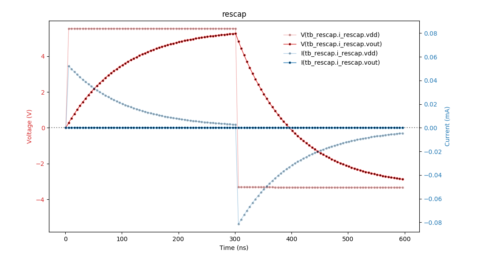

###############################
The cocotb ``rescap`` Testbench
###############################

.. versionadded:: 1.5

This is the testbench :mod:`test_rescap` for the design ``rescap`` showing
how cocotb can be used in an analog-mixed signal (AMS) simulation.

.. note:: The analog probe module used in this testcase is currently only implemented for the
          Cadence Incisive and Xcelium simulators (with the AMS option available).
          Help is appreciated to provide equivalent modules for other simulators.

******************
Overview Schematic
******************

**********
The Design
**********

The design consists of a resistor and capacitor model (both written in Verilog-AMS) connected
in series in a SystemVerilog module:

.. literalinclude:: ../../examples/mixed_signal/hdl/rescap.sv
   :caption: rescap.sv
   :language: systemverilog
   :start-at: // the design-under-test

*************
The Testbench
*************

The testbench consists of both an :term:`HDL` part and a Python/cocotb part.
While having HDL as part of the testbench is not common with cocotb, it is perfectly possible.

The HDL part of the Testbench
=============================

The testbench :term:`HDL` part is written in SystemVerilog and instantiates the design described above
as ``i_rescap``.
It also contains a probe module for analog values as instance ``i_analog_probe`` —
imagine this being a multimeter that you quickly connect to different nodes in the design,
measuring either voltage or current.

.. literalinclude:: ../../examples/mixed_signal/hdl/tb_rescap.sv
   :caption: tb_rescap.sv
   :language: systemverilog
   :start-at: import nettypes_pkg

The probe module can capture voltage and current of a node specified by ``node_to_probe``
(a string in this module containing a hierarchical path).
The capturing occurs whenever there is an edge on the logic signals
``probe_voltage_toggle`` or ``probe_current_toggle``.
The captured values can be read on real-value signals ``voltage`` and ``current`` in this module.

Here is the capture code for ``voltage`` with the "user-interface" highlighted:

.. literalinclude:: ../../examples/mixed_signal/hdl/analog_probe_cadence.sv
   :caption: analog_probe_cadence.sv
   :language: systemverilog
   :start-at: var string node_to_probe
   :end-at: end  // probe_voltage
   :emphasize-lines: 1-4
   :dedent: 2

The cocotb part of the Testbench
================================

``test_rescap_minimalist``
--------------------------

This is a very minimalist testcase.
To run it, call:

.. code-block:: bash

    make SIM=xcelium TOPLEVEL=tb_rescap MODULE=test_rescap_minimalist

The testcase supplies ``vdd``,
measures some pairs of voltage and current at ``vout``
(same as the ``p`` terminal of the capacitor),
spaced 50 ns apart,
and prints the values as shown below.

.. code-block:: bash

        50.00ns INFO     tb_hdl.i_analog_probe@tb_rescap.i_rescap.vout=2.03e-14 V  -2.996e-07 A
       100.00ns INFO     tb_hdl.i_analog_probe@tb_rescap.i_rescap.vout=3.029 V  2.67e-18 A
       150.00ns INFO     tb_hdl.i_analog_probe@tb_rescap.i_rescap.vout=4.862 V  3.574e-18 A
       200.00ns INFO     tb_hdl.i_analog_probe@tb_rescap.i_rescap.vout=5.975 V  6.285e-18 A
       250.00ns INFO     tb_hdl.i_analog_probe@tb_rescap.i_rescap.vout=6.652 V  6.171e-18 A
       300.01ns INFO     tb_hdl.i_analog_probe@tb_rescap.i_rescap.vout=7.063 V  6.033e-18 A

There is no current flowing out of the ``vout`` terminal,
so the current measurement always yields zero
(within the accuracy of the analog solver).

``test_rescap``
---------------

This is a more advanced testcase.

.. note:: This testcase depends on `matplotlib <https://matplotlib.org/>`_.

The cocotb part of the testbench provides functions to:

* do the sampling of voltage and current of a given node (:meth:`~test_rescap.ResCap_TB.get_sample_data()`),
* plot the sampled data to a file (:meth:`~test_rescap.ResCap_TB.plot_data()`).

The testcase supplies first a positive voltage to the circuit at ``vdd``, followed by a negative voltage,
thus charging the capacitor in opposite directions.
The following graph shows the charge curve.

There is no current flowing out of this output voltage terminal,
so the current measurement always yields zero.

To run this testcase, call:

.. code-block:: bash

    make SIM=xcelium TOPLEVEL=tb_rescap MODULE=test_rescap
